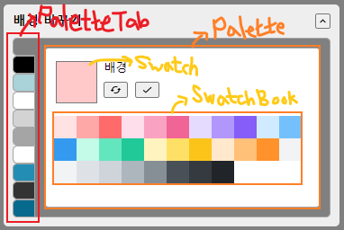

# 배경 바꾸기

## Table of Contents
  - [리덕스로 state 관리하기](#리덕스로-state-관리하기)
  - [styled-component의 theme 설정하기](#styled-component의-theme-설정하기)
  - [컴포넌트 구조](#컴포넌트-구조)
  - [PaletteTab 렌더링하기](#PaletteTab-렌더링하기)
  - [Palette 컬러 변경하기](#Palette-컬러-변경하기)

## 리덕스로 state 관리하기 

여러 컴포넌트에서 레이아웃들의 컬러값이 사용되어야 했기 때문에 리덕스를 이용해 전역적으로 state값을 관리해주었습니다. 

```js
// src/module/palette.js 

const SET_COLOR = 'palette/SET_COLOR';

export const setColor = payload => ({ type: SET_COLOR, payload });

const initialState = {
  bg: {
    title: '배경',
    color: 'gray',
  },
  layoutBorder1: {
    title: '바깥 테두리',
    color: 'black',
  },
  layoutBg1: {
    title: '바깥(1) 영역',
    color: '#a9d2d9',
  },
  layoutBorder2: {
    title: '점선 테두리',
    color: '#fff',
  },
  layoutBg2: {
    title: '바깥(2) 영역',
    color: 'lightgray',
  },
  cardBorder: {
    title: '안쪽 테두리',
    color: '#a5a5a5',
  },
  cardBg: {
    title: '안쪽 영역',
    color: '#fff',
  },
  mainColor: {
    title: '메인 메뉴',
    color: '#238db3',
  },
  headerColor: {
    title: '미니포트폴리 타이틀',
    color: '#333',
  },
  textColor: {
    title: '서브페이지 메뉴',
    color: '#07698c',
  },
};

export default function palette(state = initialState, action) {
  switch (action.type) {
    case SET_COLOR:
      const { key, value } = action.payload;
      return {
        ...state,
        [key]: {
          ...state[key],
          color: value,
        },
      };
    default:
      return state;
  }
}
```


## styled-component의 theme 설정하기 

사용자가 배경 컬러를 바꾸면 동시에 실제 적용되어 있던 컬러도 바뀌어야하므로, 리덕스 스토어에 담아둔 palette 객체를 styled-component의 `ThemeProvider`를 통해 `theme`에 넣어주었습니다. 

```js
// App.js

import React from 'react';
import { useSelector } from 'react-redux';
import { ThemeProvider } from 'styled-components';
import { Switch, Route } from 'react-router-dom';
import Home from './pages/Home';
import Profile from './pages/Profile';

const App = () => {
  const { palette } = useSelector(state => state);

  return (
    <ThemeProvider theme={palette}>
      <Switch>
        <Route path="/home">
          <Home />
        </Route>
        <Route path="/profile">
          <Profile />
        </Route>
      </Switch>
    </ThemeProvider>
  );
};
```

그리고 필요할 때마다 아래와 같이 `props.theme`으로 받아와 컬러를 설정해주었습니다. 

이렇게 하면 추후 `dispatch`를 통해 컬러를 바꾸는 액션이 취해지면, 동적으로 모든 컴포넌트에 적용되어 있던 컬러가 함께 바뀌게 될 것입니다.   

```js
const BorderWrapper = styled.div`
  width: 75%;
  height: 95vh;
  padding: 25px;
  background: ${props => props.theme.layoutBg1.color};
  border: 1px solid ${props => props.theme.layoutBorder1.color};
  border-radius: 10px;
`;
```

## 컴포넌트 구조

컴포넌트 구조는 아래와 같습니다. 이해를 돕기 위해 사진을 첨부합니다😁



가장 위 부모 컴포넌트에서 `useState` 훅을 통해 선택하는 PaletteTab 즉, 레이아웃 대상(`target`)과 Swatch 컬러(`hexColor`) state를 관리합니다. (`target`과 `hexColor`의 초기값은 임의로 고정해두었습니다)

```js
// src/components/Setting/Skin/index.js

const ChangeSkin = () => {
  const [isOpen, setIsOpen] = useState(false);
  const [target, setTarget] = useState('bg'); 
  const [hexColor, setHexColor] = useState('#ffc9c9');

  return (
    <Wrapper>
      <ToggleHeader>
        <h2>배경 바꾸기</h2>
        <ToggleButton onClick={() => setIsOpen(!isOpen)}>
          {isOpen ? <MdKeyboardArrowUp /> : <MdKeyboardArrowDown />}
        </ToggleButton>
      </ToggleHeader>
      <ToggleContent isOpen={isOpen}>
        <PaletteTab
          target={target}
          setTarget={setTarget}
          setHexColor={setHexColor}
        />
        <Palette
          target={target}
          hexColor={hexColor}
          setHexColor={setHexColor}
        />
      </ToggleContent>
    </Wrapper>
  );
};
```

## PaletteTab 렌더링하기

```js
// src/components/Setting/Skin/PaletteTab.js

import React from 'react';
import styled, { css } from 'styled-components';
import { useSelector } from 'react-redux';
import { getRandomHexColor } from '../../../utils/utils';

const PaletteTab = ({ target, setTarget, setHexColor }) => {
  const { palette } = useSelector(state => state);

  // 1. 탭 리스트
  const tabList = [];
  let index = 1;
  for (let key in palette) {
    tabList.push({ id: index++, target: key, color: palette[key].color });
  }

  // 2. 탭 클릭할 때마다 스와치 컬러 랜덤적용
  const onClick = target => {
    setTarget(target);
    setHexColor(getRandomHexColor());
  };

  return (
    <Wrapper>
      {tabList.map(tab => (
        <Tab
          key={tab.id}
          color={tab.color}
          isActive={tab.target === target}
          onClick={() => onClick(tab.target)}
        />
      ))}
    </Wrapper>
  );
};
```

1. 탭을 렌더링하기 위해 리덕스 state로 관리중인 palette의 데이터를 사용해 `tabList`라는 배열을 새롭게 생성합니다.  
2. 클릭한 탭의 target(`tab.target`)으로 부모 컴포넌트에서 관리중인 `target`의 값을 업데이트 해줍니다. 동시에 `hexColor`를 utils.js에서 임포트한 `getRandomHexColor` 함수를 통해 랜덤 값으로 바꾸어줍니다. 
```js
// src/utils/utils.js

export const getRandomHexColor = () => {
  const letters = '0123456789ABCDEF';
  let hex = '#';
  for (let i = 0; i < 6; i++) {
    hex += letters[Math.floor(Math.random() * 16)];
  }
  return hex;
};
```


## Palette 컬러 변경하기

❔ **Swatch 컬러 변경하기**
1. 하단의 기본 SwatchBook 컬러들을 클릭합니다.
2. 버튼을 클릭해 랜덤으로 변경합니다.
3. Swatch를 클릭하여 직접 컬러를 선택합니다.  

❔ **배경 컬러 변경하기**
1. Swatch를 통해 맘에 드는 컬러를 확인하였다면,
2. 버튼을 클릭하여 최종적으로 적용합니다. 

```js
// src/components/Setting/Skin/Palette.js

const Palette = ({ target, hexColor, setHexColor }) => {
  const dispatch = useDispatch();
  const { palette } = useSelector(state => state);

  // hexColor 변경
  const handleHexColor = useCallback(color => {
    setHexColor(color);
  }, []);

  // 스와치(input[type=color]) 컬러 변경
  const onChange = e => setHexColor(e.target.value);

  // 리덕스 스토어 palette 컬러 변경
  const changePaletteColor = () => {
    dispatch(
      setColor({
        key: target,
        value: hexColor,
      }),
    );
  };

  return (
    <Wrapper color={palette[target]['color']}>
      <WhiteWrapper>
        <SwatchWrapper>
          <Swatch
            type="color"
            name={target}
            value={hexColor}
            onChange={onChange}
            title="DON'T PASS ME! PICK ANOTHER COLOR!"
          />
          <SwatchInfo>
            <p>{palette[target]['title']}</p>
            <Buttons>
              <Button
                type="button"
                onClick={() => handleHexColor(getRandomHexColor())}
              >
                <MdCached />
              </Button>
              <Button type="button" onClick={changePaletteColor}>
                <MdDone />
              </Button>
            </Buttons>
          </SwatchInfo>
        </SwatchWrapper>
        <InfoTxt>↑ 스와치를 클릭하여 컬러를 선택할 수도 있습니다!</InfoTxt>
        <SwatchBook handleHexColor={handleHexColor} />
      </WhiteWrapper>
    </Wrapper>
  );
};
```

```js
const SwatchBook = ({ handleHexColor }) => {
  const colors = [ ... ]; // 생략 

  return (
    <ColorsWrapper>
      <Colors>
        {colors.map((color, index) => (
          <Color
            key={index}
            color={color}
            onClick={() => handleHexColor(color)}
          ></Color>
        ))}
      </Colors>
    </ColorsWrapper>
  );
};
```

